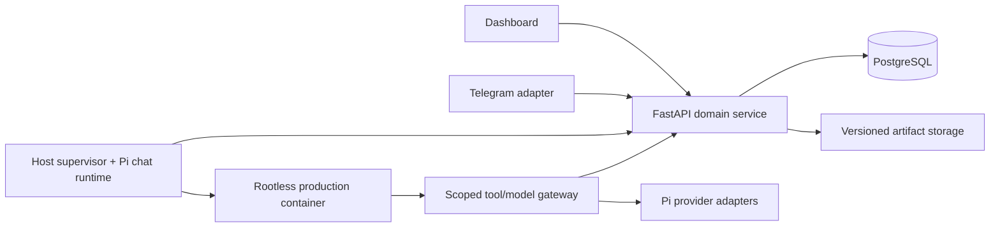

# Product and architecture

Approved design, 2026-09-18. Personal ebook business, one owner. Deliver reliable operation and readable books; no multi-user SaaS platform.

## Owner journey

The owner chats with the main orchestrator in the dashboard or linked Telegram conversation. The agent asks only for missing creative decisions, proposes defaults, and produces a structured brief: audience, promise/premise, scope, genre/profile, language, length, style, sources policy, forbidden claims/content, output formats, art direction and resource budget. The owner approves that exact revision.

The orchestrator creates a persisted work plan and delegates bounded tasks. It gathers research, makes an outline, writes sections, checks coherence/facts, revises, and assembles a draft. Routine intermediate checks are automatic. The owner sees progress without responding to child agents. Interrupt only for a real blocker (auth/quota, inaccessible source, unresolved essential choice, budget ceiling), manuscript review, or art review. Merge manuscript/art decisions where practical. Final publishing is an owner action outside v1.

If the owner sends a new direction mid-run, acknowledge immediately, persist the change request, and apply it at a checkpoint. Changes beyond the approved brief produce a new brief revision and require renewed approval. No silent rewrites of accepted work.

## Agent's working environment

An agent producing a book needs an approved brief, a durable outline, exact source excerpts/citations, relevant existing chapters, a style guide, a continuity/claim register, review findings, remaining budget and tools to save real results. Supply a bounded context packet for each task, naming input revision IDs. Do not stuff an entire novel or all transcripts into every prompt. The agent can retrieve additional sections and sources through scoped tools.

Profiles: nonfiction (evidence/claims/examples), fiction (characters/world/timeline/continuity), custom (owner-defined structured brief). All produce the same section/document/artifact model. Start with text-led reflowable ebooks. Fixed-layout picture books, comics, complex textbooks and print interiors require future profiles; unsupported layouts must be visible before production approval.

## Processes and ownership

- API owns all DB changes, tool authorization, accepted content, events and download access. Worker claims/renews jobs through private API operations backed by transactional SQL; it does not implement a second database business layer.
- Host supervisor owns container lifecycle and credentials. It exposes a Pi-backed model proxy/adapter boundary for container calls so global auth files stay outside the sandbox. Spike this boundary first; do not solve it by mounting home. Container has a job-scoped short-lived gateway capability and only selected project input/output storage.
- Pi host chat and production sessions share one logical project conversation through persisted decisions/context, not concurrent writes to one session JSONL. One active turn per conversation. Production may use task sessions; summaries are written back to the main conversation.
- API runs web delivery, lightweight export/Telegram services. One supervisor with bounded child concurrency is enough. No Redis. Heavy conversion happens in the execution container.
- Global Pi model catalog and auth store can be used through Pi's own APIs. An explicit resource loader disables inherited AGENTS/skills/extensions; allow only the app's providers/MCP adapter/tools. Provider selection is frozen per task attempt and shown in usage.

## Dashboard (reuse Ant Design or equivalent maintained components)

Project list; persistent chat; brief approval card; production timeline with task tree and honest state; chapter/outline browser with edit and revision comparison; draft/art review; exports and validation report; usage with drill-down; provider/settings screen; Telegram connection status. Reuse Markdown renderer and editor, not handwritten rich-text plumbing. Include loading/errors, keyboard operation, accessible labels, narrow-screen layout and reconnect recovery.

Usage navigation: account -> provider -> project -> run -> task -> attempt -> model call. Click a task to see input revision references, output artifacts, concise tool events and errors. Show elapsed time and completed tasks; no invented percentage of an unknown agent workload.

## Data persistence

PostgreSQL stores projects, brief revisions, conversations/messages, production runs, tasks/attempts, jobs, events/outbox, section revisions, canonical knowledge records, source records, artifacts, review findings, usage records, quota snapshots and provider settings without plaintext secrets. See CONTRACTS.md. Sessions/logs are supplemental recovery aids, never manuscript authority.

Artifact storage is an app-owned directory with immutable paths/hashes, not scattered host files. Accepted revisions cannot be overwritten. Back up DB plus artifact manifest/files together and prove restore into an isolated target.

## Scope frozen for this build

Include Pi provider/custom URL settings, real production, durable recovery, minimal editorial quality, container isolation, usage attribution and quota capability status, Telegram, image route investigation and integration, EPUB/PDF/DOCX/Markdown and publication metadata. A time target does not authorize deleting requirements.

Defer marketplace, visual graph editor, multiple tenants, autonomous Amazon submission, embeddings/vector search until retrieval quality requires them, elaborate agent personas, and distributed workers. Document these as future work, not installed scaffolding.

## Corrections to earlier discussion

MuMu's queue is not restart-resumable: it keeps callables in memory and marks pending/running tasks failed at startup. Reuse its content/UI concepts, implement the durable queue separately. A sandbox protects execution; revisioned artifacts solve content lineage. Both are necessary. Private use of GPL code is not automatically a requirement to publish private changes; any distribution decision needs a specific license review. Pi image-input support does not establish image-generation support.
